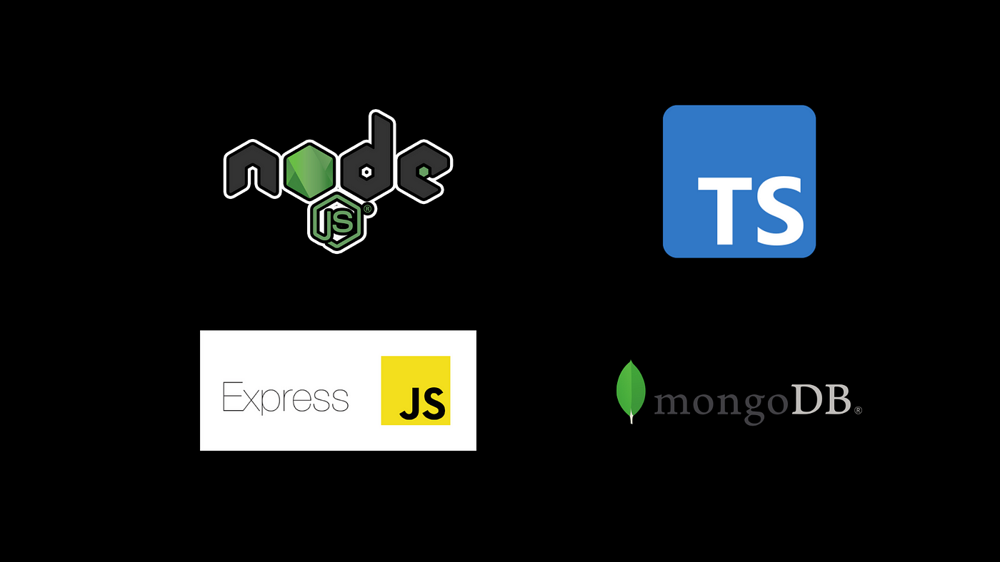

<div align="center">
<br>

<h2>NodeJS SetUp</h2>
</div>

<br/><br/>
### Installation Commands
#### SetUp Project
```shell
npm init -y
```
#### Install TypeScript
```shell 
npm install -D typescript 
```
#### Install TypeScript Node
```shell
npm install -D ts-node
```
#### Install Nodemon to running the project on development
```shell
npm install -D nodemon
```
<br/><br/>

#### Now create the TypeScript Configuration file in the root directory
```shell
tsc --init
// Create tsconfig.json file and change 
"sourceMap": true,  
"baseUrl": "./src",
"outDir": "./dist",  

```
#### Create new file nodemon.json to configure nodemon
```shell
nodemon.json
// wrire this code into nodemon.json file
{
  "watch" : "src",
  "ext" : ".js,.ts",
  "exec" : "ts-node ./src/index.ts"
}
```
<br/><br/>
##### Create new folder src and create new file index.ts
#### Now update the package.json file
```shell
"scripts": {
    "start": "nodemon", // add this line to the package.json file
    "test": "echo \"Error: no test specified\" && exit 1"
  },
```

#### Run Project
```shell
npm start
```

<br/><br/>

#### SetUp Express
```shell
npm i express body-parser cookie-parser compression cors
npm i -D @types/express @types/body-parser @types/cookie-parser @types/compression @types/cors
```
#### Install Mongo DB
```shell
npm install mongoose
npm install -D @types/mongoose
```

<br/><br/>
#### SerUp Database
```shell
create ./Database/Connection.ts

And Inside Index.ts file Add those line

const DbConnection = require('./dataBase/Connection'); 
DbConnection().then(()=>{
  server.listen(8080, () => {
    console.log('Successfully database connected');
    console.log('Server listening on http://localhost:8080/');
  });
});
```
#### SetUp ENV variables
```shell
npm install dotenv
npm install @types/dotenv --save-dev
```
